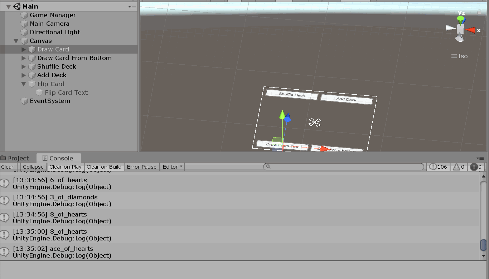

## Milestone #3 Vanja DD ##

This assignment was overall quite simple for me to execute. Heading into it, I was a bit worried about the shuffle and add deck functions but was able to write them both in about 15 minutes, so I was pleasantly surprised. The things I had difficulty with are actually still unsolved, not from lack of effort, but rather from being at a loss as to how to accomplish them in line with the provided design doc. The main issue I'm having is actually implementing the Flip() method within Card, as Card does not inherit from MonoBehavior and thus cannot be targetted through Unity tool methods like GetComponent, Find doesn't seem to work either but I might try a few different ideas with that in the future. I found that trying to store a reference to the last card spawned using the base code provided was a lot more difficult than it would seem given the way that objects are instantiated. I want to reformat this code base to be a bit more useful; I would have done so already if I'd had more time this last week to do this assignment. The other issue I experienced was stacking cards so that the last spawned card is guaranteed to be on top. Since the cards are represented as two planes and don't have a Z depth, it's a bit odd to work with them. Unity would NOT let me utilize a stack with gameobjects, I also attempted to utilize the mesh renderer's render queue and the shader's render queue, neither of which worked. The only functional approach I found was just increasing the Z placement of the vector3 in the card instantiation relative to the number of cards that have been drawn, however, this causes the cards to "grow" as they approach the camera, an issue I could not easily resolve and deemed too complicated to tackle at this time (my idea was to move previously spawned cards back in the Z dimension, though that would require storing a refernece to the last spawned card and in that case I'd just destroy it or something).

The basic and (kind of) the advanced design requirements were not that challenging for me to meet this milestone, but I did hvae a lot of trial and error and am still not feeling super comfortable in Unity. I'm getting a bit more used to the like tempObject = otherObject.GetComponent<Component1>(); tempObject.SubComponent.method(variable); type commands. The sheer amount of recursive periods in working with Unity causes me a lot of problems trying to figure out how to get a hold of or even access a particlar object or script. It's getting better though and I do feel a sense of improvement and comfort with it. Looking forward to the next milestone and still not sure if I want to do Poker / Texas Hold'Em so that I can work off this code base and make some structural changes and (hopefully) make it more useful. I am sort of sick of cards though, so we'll see!

